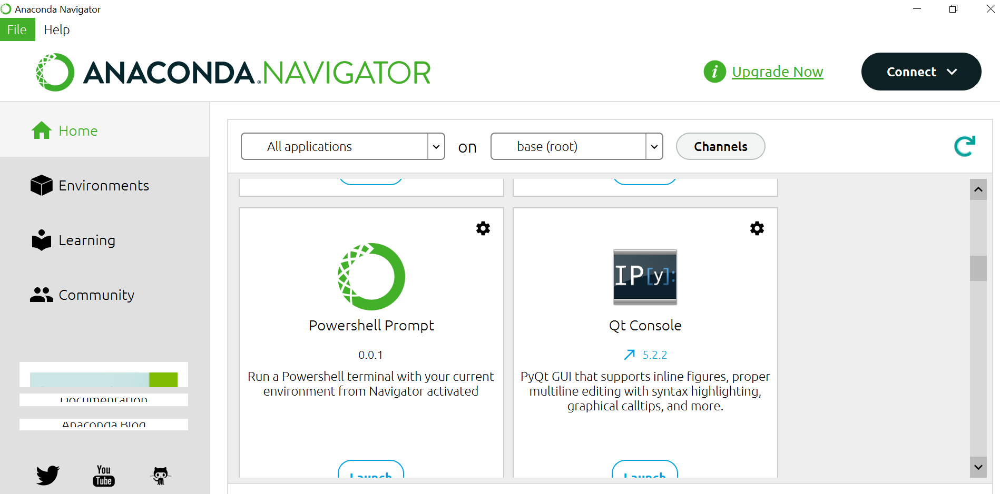
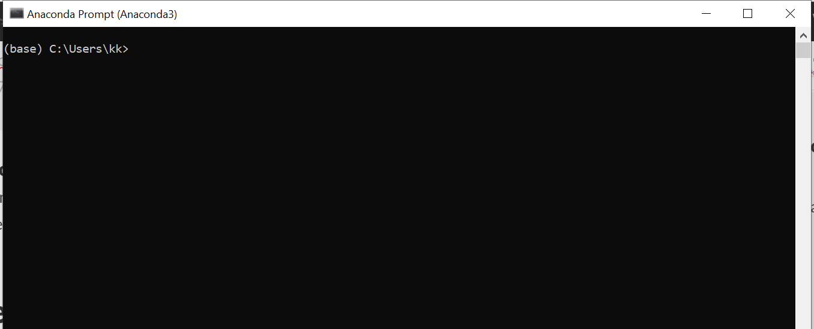
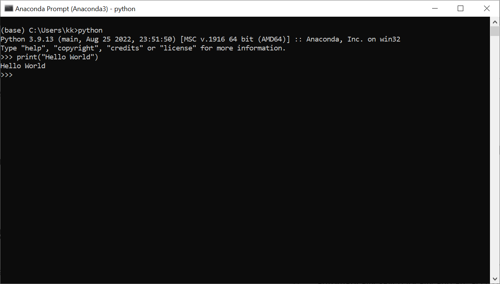

# Python Installation & Setup.
The simplest and easiest way to get python running on your system is to use Anaconda installation.

## Install Anaconda
Download and Install Anaconda from https://www.anaconda.com/products/distribution 
After successful installation, you will be able to use 

 - Anaconda Navigator
 - Conda (Command Prompt utility)
 - Jupyter
 - Jupyter NoteBook 
on your PC. 

### Anaconda Navigator.

### Anaconda Prompt/Anaconda Console.
To open Anaconda Prompt on Windows navigate to: 
Start -> Search -> Anaconda Prompt. 
and then you will see a window like this. 

Here you can start writing your python code. Before writing python code you will first need to initialize python by using using  'python' keyword. After python is initialized you can write any python directly in console. 

### Hello World/Printing your first code.
 

    print("Hello World!")

